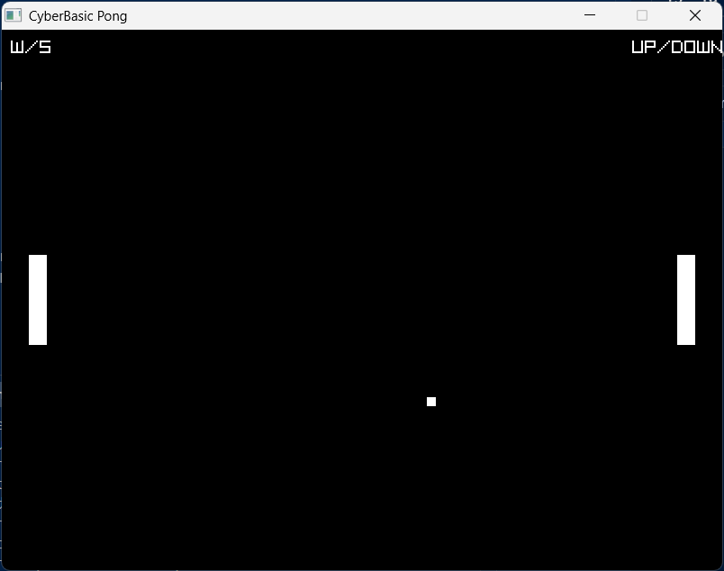
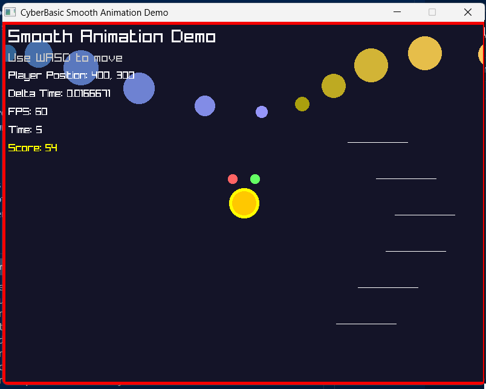

# CyberBasic


*Above: The official logo for CyberBasic, a modern take on classic BASIC programming.*

**The Modern BASIC Language for Game Development**

CyberBasic combines the simplicity and elegance of classic BASIC programming with the full power of modern game development. Write games, graphics applications, and interactive programs using familiar BASIC syntax while leveraging the complete Raylib graphics library.



*Above: A fully functional Pong game written in CyberBasic, demonstrating real-time graphics, input handling, and collision detection.*



*Above: A smooth animation demo showcasing real-time graphics, particle effects, smooth movement, and performance metrics - all in just a few lines of BASIC code.*

## Why CyberBasic?

Remember when programming was fun and accessible? When you could create games in just a few lines of code? CyberBasic brings back that magic while giving you access to modern graphics, audio, and input systems.

**Perfect for:**
- Learning programming fundamentals
- Rapid game prototyping
- Educational projects
- Retro-style game development
- Anyone who wants to code without complexity

## What Makes It Special

### Complete BASIC Language
Full implementation of classic BASIC features with modern enhancements:
- Variables, arrays, and functions
- Control flow (IF/THEN, WHILE/WEND, FOR/NEXT)
- String manipulation and math functions
- File I/O operations
- Optional strict typing and scoping

### 527 Raylib Functions
Every single Raylib function is available in BASIC:
- **Graphics**: 2D/3D rendering, textures, models, shaders
- **Audio**: Sound effects, music, 3D spatial audio
- **Input**: Keyboard, mouse, gamepad support
- **Physics**: Collision detection, rigid body simulation
- **Window Management**: Multi-monitor support, fullscreen modes

### Zero Configuration
No complex setup, no dependencies to manage. Just write BASIC code and run it.

## Quick Start

### Windows (Recommended)
```bash
# Clone and build
git clone https://github.com/CharmingBlaze/cyberbasic.git
cd cyberbasic
mkdir build-mingw && cd build-mingw
cmake -G "MinGW Makefiles" ..
cmake --build .

# Run your first program
../cyberbasic.exe simple_pong.bas
```

### Your First Game
```basic
REM Simple bouncing ball
INITWINDOW(800, 600, "My First Game")
SETTARGETFPS(60)

LET ballX = 400
LET ballY = 300
LET speedX = 3
LET speedY = 3

WHILE NOT WINDOWSHOULDCLOSE()
    LET ballX = ballX + speedX
    LET ballY = ballY + speedY
    
    IF ballX < 0 OR ballX > 790 THEN LET speedX = -speedX
    IF ballY < 0 OR ballY > 590 THEN LET speedY = -speedY
    
    BEGINDRAW()
    CLEARBACKGROUND(0, 0, 0)
    DRAWRECTANGLE(ballX, ballY, 20, 20, 255, 255, 255)
    ENDDRAW()
WEND

CLOSEWINDOW()
```

## Real Examples

### Smooth Animation Demo
```basic
REM Smooth movement with animated effects
INITWINDOW(800, 600, "Smooth Animation Demo")
SETTARGETFPS(60)

LET player_x = 400.0
LET player_y = 300.0
LET player_speed = 300.0

WHILE NOT WINDOWSHOULDCLOSE()
    LET delta_time = GETDELTATIME()
    
    REM Smooth WASD movement
    IF ISKEYDOWN(KEY_W) THEN LET player_y = player_y - player_speed * delta_time
    IF ISKEYDOWN(KEY_S) THEN LET player_y = player_y + player_speed * delta_time
    IF ISKEYDOWN(KEY_A) THEN LET player_x = player_x - player_speed * delta_time
    IF ISKEYDOWN(KEY_D) THEN LET player_x = player_x + player_speed * delta_time
    
    BEGINDRAW()
    CLEARBACKGROUND(20, 20, 40)
    
    REM Animated background circles
    LET current_time = GETTIME()
    FOR i = 0 TO 10
        LET x = (i * 80) + (SIN(current_time + i) * 30)
        LET y = 100 + (COS(current_time + i * 0.7) * 50)
        DRAWCIRCLE(x, y, 20, 50 + i * 20, 100 + i * 10, 150 + i * 20)
    NEXT
    
    REM Player with animated effects
    DRAWCIRCLE(player_x, player_y, 25, 255, 255, 0)
    DRAWTEXT("FPS: " + STR(GETFPS()), 10, 10, 20, 255, 255, 255)
    ENDDRAW()
WEND

CLOSEWINDOW()
```

### Interactive Graphics
```basic
REM Mouse-following circle
INITWINDOW(800, 600, "Mouse Demo")
SETTARGETFPS(60)

WHILE NOT WINDOWSHOULDCLOSE()
    LET mouseX = GETMOUSEX()
    LET mouseY = GETMOUSEY()
    
    BEGINDRAW()
    CLEARBACKGROUND(50, 50, 100)
    DRAWCIRCLE(mouseX, mouseY, 30, 255, 200, 100)
    DRAWTEXT("Move your mouse!", 10, 10, 20, 255, 255, 255)
    ENDDRAW()
WEND

CLOSEWINDOW()
```

### Audio Integration
```basic
REM Sound effects and music
INITWINDOW(800, 600, "Audio Demo")
INITAUDIODEVICE()

LET sound = LOADSOUND("beep.wav")
LET music = LOADMUSICSTREAM("background.mp3")

PLAYMUSICSTREAM(music)

WHILE NOT WINDOWSHOULDCLOSE()
    IF ISKEYPRESSED(KEY_SPACE) THEN PLAYSOUND(sound)
    
    UPDATEMUSICSTREAM(music)
    
    BEGINDRAW()
    CLEARBACKGROUND(0, 0, 0)
    DRAWTEXT("Press SPACE for sound", 300, 300, 20, 255, 255, 255)
    ENDDRAW()
WEND

UNLOADSOUND(sound)
UNLOADMUSICSTREAM(music)
CLOSEAUDIODEVICE()
CLOSEWINDOW()
```

### 3D Graphics
```basic
REM 3D rotating cube
INITWINDOW(800, 600, "3D Demo")
SETTARGETFPS(60)

LET camera = CAMERA3D()
LET camera.position = VECTOR3(0, 10, 10)
LET camera.target = VECTOR3(0, 0, 0)
LET camera.up = VECTOR3(0, 1, 0)
LET camera.fovy = 45
LET camera.projection = CAMERA_PERSPECTIVE

LET rotation = 0

WHILE NOT WINDOWSHOULDCLOSE()
    LET rotation = rotation + 1
    
    BEGINDRAW()
    CLEARBACKGROUND(0, 0, 0)
    BEGINDRAW3D(camera)
    
    DRAWCUBE(VECTOR3(0, 0, 0), 2, 2, 2, RED)
    DRAWCUBEWIRES(VECTOR3(0, 0, 0), 2, 2, 2, WHITE)
    
    ENDDRAW3D()
    DRAWTEXT("3D Cube Demo", 10, 10, 20, WHITE)
    ENDDRAW()
WEND

CLOSEWINDOW()
```

## Complete Game Example

The included Pong game demonstrates:
- Real-time input handling
- Collision detection
- Game loop architecture
- Graphics rendering
- Window management

```basic
REM Full Pong implementation
INITWINDOW(800, 600, "CyberBasic Pong")
SETTARGETFPS(60)

LET leftPaddleY = 250
LET rightPaddleY = 250
LET ballX = 400
LET ballY = 300
LET ballSpeedX = 3
LET ballSpeedY = 3

WHILE NOT WINDOWSHOULDCLOSE()
    REM Handle input
    IF ISKEYHELD(KEY_W) THEN LET leftPaddleY = leftPaddleY - 5
    IF ISKEYHELD(KEY_S) THEN LET leftPaddleY = leftPaddleY + 5
    IF ISKEYHELD(KEY_UP) THEN LET rightPaddleY = rightPaddleY - 5
    IF ISKEYHELD(KEY_DOWN) THEN LET rightPaddleY = rightPaddleY + 5
    
    REM Update ball
    LET ballX = ballX + ballSpeedX
    LET ballY = ballY + ballSpeedY
    
    REM Collision detection
    IF ballY < 0 OR ballY > 590 THEN LET ballSpeedY = -ballSpeedY
    IF ballX <= 50 AND ballX >= 30 AND ballY >= leftPaddleY AND ballY <= leftPaddleY + 100 THEN LET ballSpeedX = -ballSpeedX
    IF ballX >= 740 AND ballX <= 770 AND ballY >= rightPaddleY AND ballY <= rightPaddleY + 100 THEN LET ballSpeedX = -ballSpeedX
    
    REM Render
    BEGINDRAW()
    CLEARBACKGROUND(0, 0, 0)
    DRAWRECTANGLE(30, leftPaddleY, 20, 100, WHITE)
    DRAWRECTANGLE(750, rightPaddleY, 20, 100, WHITE)
    DRAWRECTANGLE(ballX, ballY, 10, 10, WHITE)
    DRAWTEXT("W/S", 10, 10, 20, WHITE)
    DRAWTEXT("UP/DOWN", 700, 10, 20, WHITE)
    ENDDRAW()
WEND

CLOSEWINDOW()
```

## Architecture

CyberBasic is built with modern C++17 and follows clean architecture principles:

### Core Components
- **Lexer**: Converts BASIC source code into tokens
- **Parser**: Builds an Abstract Syntax Tree (AST)
- **Interpreter**: Executes the AST with full runtime support
- **Function Registry**: Manages built-in and user-defined functions
- **Code Generator**: Auto-generates Raylib bindings from YAML specifications

### File Structure
```
cyberbasic/
├── src/                    # Core interpreter implementation
│   ├── main.cpp           # Application entry point
│   ├── lexer.cpp          # Tokenization engine
│   ├── parser.cpp         # AST construction
│   ├── interpreter.cpp    # Runtime execution
│   ├── builtins_core.cpp  # Core BASIC functions
│   ├── builtins_console.cpp # Console I/O
│   └── rt_raylib.gen.cpp  # Generated Raylib bindings
├── include/bas/           # Public headers
├── specs/                 # YAML function specifications
├── tools/                 # Build and code generation tools
├── examples/              # Sample programs and games
└── simple_pong.bas        # Complete Pong game
```

## Building from Source

### Prerequisites
- CMake 3.20 or higher
- MinGW-w64 GCC 13+ (Windows) or GCC/Clang (Linux/macOS)
- Python 3.10+ with PyYAML

### Windows Build
```bash
git clone https://github.com/CharmingBlaze/cyberbasic.git
cd cyberbasic
mkdir build-mingw && cd build-mingw
cmake -G "MinGW Makefiles" -DCMAKE_BUILD_TYPE=Release ..
cmake --build .
```

### Linux/macOS Build
```bash
git clone https://github.com/CharmingBlaze/cyberbasic.git
cd cyberbasic
mkdir build && cd build
cmake -DCMAKE_BUILD_TYPE=Release ..
make -j$(nproc)
```

## Supported BASIC Features

### Core Language
- **Variables**: `LET x = 10` or `x = 10`
- **Arrays**: `DIM arr(10)`, `arr(5) = 100`
- **Functions**: `SUB`, `FUNCTION`, `RETURN`
- **Control Flow**: `IF/THEN/ENDIF`, `WHILE/WEND`, `FOR/NEXT`
- **File I/O**: `OPEN`, `CLOSE`, `READ`, `WRITE`

### Advanced Features
- **Optional Strict Mode**: `OPTION EXPLICIT` for variable declaration checking
- **Scoping**: `LOCAL` and `GLOBAL` variable declarations
- **Error Handling**: Comprehensive runtime error reporting
- **Debug Support**: Built-in debugging capabilities

## Raylib Integration

All 527 Raylib functions are available with automatic type conversion:

### Window Management
```basic
INITWINDOW(800, 600, "My Game")
SETTARGETFPS(60)
SETWINDOWTITLE("New Title")
CLOSEWINDOW()
```

### 2D Graphics
```basic
DRAWRECTANGLE(100, 100, 200, 150, RED)
DRAWCIRCLE(400, 300, 50, BLUE)
DRAWTEXT("Hello World", 10, 10, 20, WHITE)
DRAWTEXTURE(texture, 0, 0, WHITE)
```

### 3D Graphics
```basic
DRAWCUBE(VECTOR3(0, 0, 0), 2, 2, 2, RED)
DRAWSPHERE(VECTOR3(0, 0, 0), 1, GREEN)
DRAWMODEL(model, VECTOR3(0, 0, 0), 1, WHITE)
```

### Audio
```basic
LET sound = LOADSOUND("beep.wav")
PLAYSOUND(sound)
LET music = LOADMUSICSTREAM("song.mp3")
PLAYMUSICSTREAM(music)
```

### Input
```basic
IF ISKEYDOWN(KEY_W) THEN LET playerY = playerY - 5
LET mouseX = GETMOUSEX()
LET mouseY = GETMOUSEY()
IF ISMOUSEBUTTONPRESSED(MOUSE_BUTTON_LEFT) THEN PRINT "Click!"
```

## Development

### Adding New Functions
1. Add function specification to `specs/raylib_api.yaml`
2. Run `python tools/gen_raylib_bindings.py`
3. Rebuild the project

### Code Style
- C++17 standard with strict warnings
- Modular design with single responsibility
- Comprehensive error handling
- No global static initialization
- Files under 250 lines where possible

## Performance

CyberBasic is designed for both learning and production use:
- **Fast startup**: Programs begin execution immediately
- **Efficient execution**: Optimized interpreter with minimal overhead
- **Memory safe**: Automatic memory management with no leaks
- **Cross-platform**: Consistent performance across Windows, Linux, and macOS

## License

This project is open source. See the LICENSE file for details.

## Contributing

We welcome contributions! Whether you're fixing bugs, adding features, or improving documentation:

1. Fork the repository
2. Create a feature branch
3. Make your changes
4. Add tests if applicable
5. Submit a pull request

## Roadmap

- Enhanced error messages with line numbers and suggestions
- Integrated debugger with breakpoints and variable inspection
- IDE integration with syntax highlighting and autocomplete
- Additional BASIC dialects (QBASIC, Visual Basic compatibility)
- Performance optimizations and JIT compilation
- Web-based editor and runtime

## Support

For questions, bug reports, or feature requests, please open an issue on GitHub.

---

**CyberBasic** - Where classic programming meets modern game development. Start coding games today, not tomorrow.