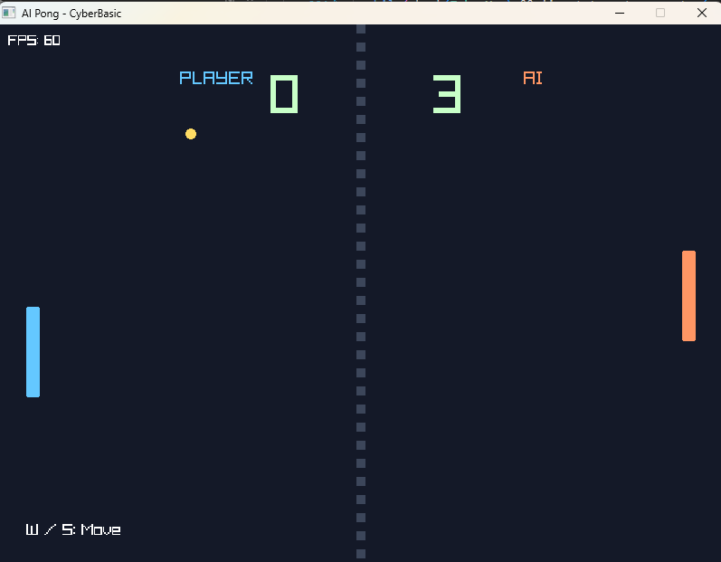
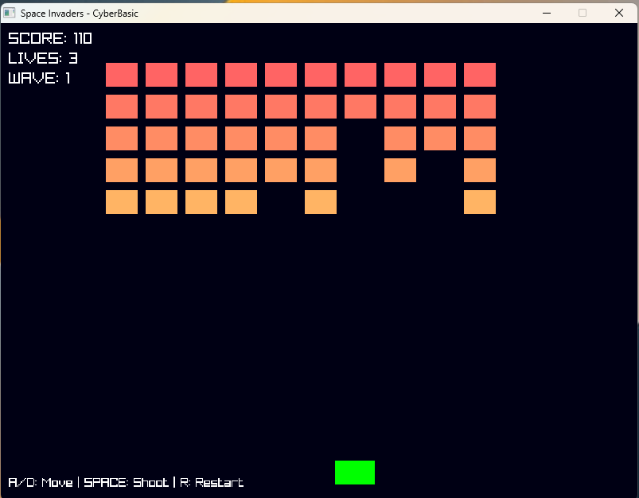
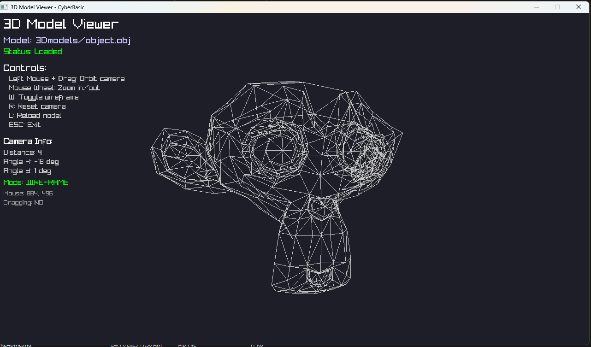

# CyberBasic


**The Modern BASIC Language for Game Development**

CyberBasic combines the simplicity and elegance of classic BASIC programming with the full power of modern game development. Write games, graphics applications, and interactive programs using familiar BASIC syntax while leveraging the complete Raylib graphics library.

> **Distribution focus:** CyberBasic is primarily offered as a plug-and-play Windows executable (`cyberbasic.exe`). Linux and macOS users are welcome—and fully supported—to compile from source using the instructions later in this README, but I only distribute binaries for Windows.

##  Quick Start

### Download the Windows Executable (Recommended)

CyberBasic is primarily distributed as a ready-to-run Windows executable so players never have to touch a compiler. Every push to `master` produces a fresh `cyberbasic.exe` on GitHub Actions—grab it and start building games immediately.

**Steps (pick whichever you prefer):**

1. **Direct download:** Grab the current binary at [bin/cyberbasic.exe](https://github.com/CharmingBlaze/cyberbasic/raw/master/bin/cyberbasic.exe) (committed in this repo so the URL is permanent). Save it somewhere convenient and run `cyberbasic.exe your_game.bas`.
2. **CI artifact download:**  
   a. Open the latest [Build CyberBasic workflow run](https://github.com/CharmingBlaze/cyberbasic/actions/workflows/build.yml).  
   b. Select the newest successful run on `master`.  
   c. Download the `cyberbasic-windows` artifact (zip).  
   d. Extract it and run `cyberbasic.exe your_game.bas`.

**Why Windows users should rely on the artifact:**
- ✅ Fresh, statically linked `cyberbasic.exe` on every push
- ✅ Same binary I use locally—fully tested before distribution
- ✅ No toolchains, MinGW, or CMake setup required
- ✅ Includes `README.md` and `docs/HOW_TO_USE.md` so everything is in one zip

> **Linux/macOS developers:** I don’t ship executables for those platforms. You’re welcome to build CyberBasic yourself using the documentation inside `source/README.md`, but please understand I can’t provide hands-on macOS support because I don’t own that hardware.

**Need a portable Windows exe for your own release builds?** The repository already includes `bin/cyberbasic.exe`. Copy it wherever you like and share it with your players—no extra tooling required. Developers who want to rebuild the runtime can visit `source/README.md` for full instructions (kept separate from this user-focused guide).

---

### Continuous Integration Builds

The `.github/workflows/build.yml` pipeline keeps CyberBasic honest:

- **Windows (MinGW + MSYS2)** – produces the official `cyberbasic.exe` artifact described above. This is the version I expect most users to run.
- **Linux (GCC)** – ensures the project keeps compiling cleanly on Linux so developers there can build locally without surprises. I don’t redistribute that binary, but the job proves the source stays portable.

Anyone can inspect the workflow run to audit the build steps before downloading the Windows artifact or before compiling on their own system.

### Create Your First Game

Create `my_game.bas`:

```basic
REM My First CyberBasic Game
INITWINDOW(800, 600, "My Game")
SETTARGETFPS(60)

VAR x = 400
VAR y = 300
VAR speed = 5

WHILE NOT WINDOWSHOULDCLOSE()
    IF ISKEYDOWN(KEY_W) THEN y = y - speed
    IF ISKEYDOWN(KEY_S) THEN y = y + speed
    IF ISKEYDOWN(KEY_A) THEN x = x - speed
    IF ISKEYDOWN(KEY_D) THEN x = x + speed
    
    BEGINDRAW()
    CLEARBACKGROUND(20, 20, 30)
    DRAWCIRCLE(x, y, 30, 255, 100, 100)
    ENDDRAW()
WEND

CLOSEWINDOW()
```

Run it: `cyberbasic.exe my_game.bas`

---

##  Using the Interpreter

### Basic Usage

The CyberBasic interpreter runs `.bas` files. Here's how to use it:

**Windows (prebuilt):**
```bash
# From anywhere inside the repo
.\bin\cyberbasic.exe path\to\your\program.bas
.\bin\cyberbasic.exe examples\hello_text.bas
```

> If you downloaded the `cyberbasic-windows` artifact or copied `bin\cyberbasic.exe` elsewhere, just run it directly—no build step required.

**Linux/macOS:** CyberBasic currently ships as a Windows executable only. If you’re on another platform you’ll need to build it yourself—see `source/README.md` for the developer-focused steps (kept out of this guide so end users aren’t distracted).

### Running Examples

The repository includes 69+ example programs in the `examples/` directory:

```bash
# Windows
.\bin\cyberbasic.exe examples\hello_text.bas
.\bin\cyberbasic.exe examples\simple_pong.bas
.\bin\cyberbasic.exe examples\space_invaders.bas

# Linux/macOS (after you produce your own build)
# See source/README.md if you truly need this.
./cyberbasic examples/hello_text.bas
./cyberbasic examples/simple_pong.bas
./cyberbasic examples/space_invaders.bas
```

### Paths and Directories

- Use forward slashes `/` or double backslashes `\\` in file paths on Windows
- Relative paths are relative to the current working directory, not the executable location
- You can run programs from any directory by using absolute or relative paths

### Distribution Build (Windows)

The repo already includes a statically linked Windows interpreter at `bin/cyberbasic.exe`. Drop that file next to your `.bas` game and ship it. Nothing else required.

---

##  Documentation

### Essential Guides

- **[How to Use CyberBasic](docs/HOW_TO_USE.md)** - Complete guide to using cyberbasic.exe, running examples, and troubleshooting
- **[Game Development Guide](docs/GAME_DEVELOPMENT_GUIDE.md)** - Complete guide to making games
- **[2D Graphics API Guide](docs/2D_GRAPHICS_GUIDE.md)** - Learn 2D rendering, sprites, textures
- **[3D Graphics API Guide](docs/3D_GRAPHICS_GUIDE.md)** - Learn 3D rendering, models, cameras, lighting
- **[Distribution Guide](docs/DISTRIBUTION_GUIDE.md)** - How to distribute your games

### Quick References
- **[Quick Reference](docs/QUICK_REFERENCE.md)** - Quick syntax reference
- **[BASIC Programming Guide](docs/BASIC_PROGRAMMING_GUIDE.md)** - Complete language reference

### Advanced Features
- **[Advanced Features Guide](docs/ADVANCED_FEATURES_GUIDE.md)** - Enums, dot notation, state machines, ECS, coroutines, tuples
- **[ECS System Guide](docs/ECS_SYSTEM_GUIDE.md)** - Entity-Component-System architecture
- **[Modern State System Guide](docs/MODERN_STATE_SYSTEM_GUIDE.md)** - State machine system

---

##  What CyberBasic Offers

### Complete Modern BASIC Language

**Case-Insensitive:** CyberBasic is case-insensitive, just like classic BASIC. Keywords and identifiers can be written in any case:
```basic
VAR x = 10              REM All of these work the same:
var y = 20              REM VAR, var, Var are equivalent
Var z = 30              REM myVar, MyVar, MYVAR refer to same variable
```

**Variables & Constants:**
```basic
VAR x = 10              REM Modern variable (can be used anywhere)
LET y = 20              REM Classic variable
CONST PI = 3.14159      REM Immutable constant
```

**Arrays:**
```basic
DIM arr[10]             REM Classic style
VAR items = []           REM Modern empty array
VAR matrix[5, 10]       REM 2D array

REM Advanced operations
arr.insert(6)           REM Insert element
arr.remove()            REM Remove last
arr.sort()              REM Sort array
arr.find(5)             REM Find element
```

**Dictionaries:**
```basic
VAR dict = {"key": "value", 2: 3}           REM JSON-style
VAR other = {key = "value", other_key = 2}   REM BASIC-style
```

**Types:**
```basic
TYPE Player
    x AS NUMBER
    y AS NUMBER
    health AS INTEGER
END TYPE

VAR player = Player()
player.x = 100
player.y = 200
```

**Functions:**
```basic
FUNCTION add(a, b) AS INTEGER
    RETURN a + b
END FUNCTION

FUNCTION getSize() AS tuple
    RETURN (800, 600)
END FUNCTION

VAR (w, h) = getSize()  REM Tuple destructuring
```

**Control Flow:**
```basic
IF condition THEN
    REM code
ELSEIF other THEN
    REM code
ELSE
    REM code
ENDIF

WHILE condition
    REM code
WEND

FOR i = 1 TO 10
    REM code
NEXT

SELECT CASE value
    CASE 1
        REM code
    CASE 2
        REM code
END SELECT
```

**Dot Notation:**
```basic
VAR pos = Vector2(100, 200)
pos.x = pos.x + 5
PRINT "X: " + STR(pos.x)

VAR color = Color(255, 100, 100, 255)
PRINT "R: " + STR(color.r)
```

### 527 Raylib Functions

**2D Graphics:**
- Primitives: rectangles, circles, lines, triangles, polygons
- Textures: loading, drawing, sprite sheets
- Text: fonts, formatting, measurements
- Camera: 2D camera system

**3D Graphics:**
- Primitives: cubes, spheres, planes, grids
- Models: loading, animation, transformations
- Camera: first-person, third-person, orthographic
- Lighting: directional, point, spot lights
- Materials: textures, PBR materials

**Audio:**
- Sound effects: loading, playing, 3D spatial audio
- Music: streaming, looping, volume control

**Input:**
- Keyboard: key states, key codes
- Mouse: position, buttons, wheel
- Gamepad: controller support

**Window Management:**
- Window creation, resizing, fullscreen
- Multi-monitor support
- Window icons and titles

### Advanced Game Development Features

**ECS (Entity-Component-System):**
```basic
COMPONENT Position {x = 0, y = 0}
COMPONENT Velocity {dx = 0, dy = 0}

VAR player = ENTITY()
player.ADD(Position(100, 200))
player.ADD(Velocity(2, 0))

SYSTEM Movement(Position, Velocity)
    Position.x += Velocity.dx
    Position.y += Velocity.dy
END SYSTEM

RUN Movement
```

**State Machines:**
```basic
STATE Idle
    ON UPDATE
        REM idle logic
    END
    TRANSITION TO Walking WHEN keyPressed
END STATE
```

**Coroutines:**
```basic
FUNCTION animate() AS coroutine
    FOR i = 1 TO 10
        PRINT "Step " + i
        YIELD
    NEXT
END FUNCTION
```

**Timers:**
```basic
TIMER(1000, repeat = true) -> PRINT "Tick every second"
WAIT(2.0)  REM Pause for 2 seconds
```

**Tuples:**
```basic
VAR pos = (100, 200)
VAR (x, y) = pos  REM Destructuring
```

**Enums:**
```basic
ENUM Direction
    UP
    DOWN
    LEFT
    RIGHT
END ENUM

ENUM Status
    IDLE = 0
    WALKING = 1
    RUNNING = 2
END ENUM
```

---

##  Examples

The repository includes **69+ example programs** in the `examples/` directory:

### Game Examples





- `pong_game.bas` - Complete Pong game with AI
- `space_invaders.bas` - Classic Space Invaders game
- `model_viewer.bas` - 3D model viewer with mouse orbit controls
- `space_defender.bas` - Space shooter with AI enemies
- `2d_game_template.bas` - 2D game template
- `3d_game_template.bas` - 3D game template
- `complete_game_demo.bas` - Full game example

### Feature Examples
- `hello_graphics.bas` - Basic graphics
- `smooth_animation_demo.bas` - Smooth animations
- `audio_demo.bas` - Audio system
- `gui_demo.bas` - GUI system
- `physics_demo.bas` - Physics simulation
- `models3d_demo.bas` - 3D models
- `complete_3d_game_demo.bas` - Complete 3D game

### Language Examples
- `var_const_demo.bas` - Variables and constants
- `dot_notation_demo.bas` - Dot notation
- `dictionary_literal_demo.bas` - Dictionary syntax
- `select_case_demo.bas` - Control flow

Run any example:
```bash
cyberbasic.exe examples/hello_graphics.bas
```

---

##  Architecture

CyberBasic is built with modern C++20 and follows clean architecture principles:

### Core Components
- **Lexer**: Converts BASIC source code into tokens
- **Parser**: Builds an Abstract Syntax Tree (AST)
- **Interpreter**: Executes the AST with full runtime support
- **Function Registry**: Manages built-in and user-defined functions
- **Code Generator**: Auto-generates Raylib bindings from YAML specifications

### File Structure
```
cyberbasic/
├── bin/                 # Ready-to-run Windows executable
├── docs/                # Guides for learning and shipping CyberBasic games
├── examples/            # 69+ sample games and demos
├── images/              # Logos + showcase screenshots
├── source/              # Full compiler/runtime source tree (for developers)
└── 3Dmodels/            # Assets used by bundled examples
```

Developers who need the full C++ source can dive into `source/` and read `source/README.md`, but everyone else can ignore that folder entirely.

---

##  Language Features

### Core Language
- **Case-Insensitive**: Keywords and identifiers can be written in any case (`VAR`, `var`, `Var` all work)
- **Variables**: `VAR`, `LET`, and `CONST` declarations
- **Arrays**: Classic `DIM` and modern `VAR arr[10]` syntax
- **Array Operations**: `.length`, `.insert()`, `.remove()`, `.sort()`, `.find()`, `.reverse()`, `.swap()`
- **Dictionaries**: `{"key": "value"}` or `{key = "value"}` syntax
- **Types**: User-defined types with `TYPE ... ENDTYPE` and JSON serialization
- **Functions**: Parameters, return values, `ENDFUNCTION value`, tuple returns
- **Control Flow**: IF/THEN/ELSE/ELSEIF, WHILE/WEND, FOR/NEXT, SELECT CASE, GOSUB/GOTO/RETURN
- **Operators**: Arithmetic, relational, boolean, and bitwise operators
- **Dot Notation**: Access object properties and methods
- **Module System**: `IMPORT "file.bas"` or `INCLUDE "file.bas"`
- **Error Handling**: Comprehensive error messages with line numbers

### Game Development Features
- **ECS System**: Entity-Component-System for game architecture
- **State Machine**: Modern BASIC-style state system
- **Sprite System**: Sprite creation, animation, and management
- **Collision Detection**: Built-in collision checking
- **Camera System**: 2D and 3D camera management
- **Input Events**: Keyboard, mouse, and gamepad handling
- **Timer System**: Game timing, delta time, scheduled timers
- **Animation System**: Sprite and object animation

### Advanced Features
- **Coroutines**: Suspension and resumption with `YIELD` and `AWAIT`
- **Tuples**: Lightweight grouped values with destructuring
- **Enums**: Named and unnamed enums with custom values
- **Component Defaults**: Default values in component declarations
- **System Priority**: Priority-based system execution
- **JSON Support**: Serialize/deserialize arrays and types
- **Debug Support**: Built-in debugging capabilities

---

##  Use Cases

**Perfect for:**
- Learning programming fundamentals
- Rapid game prototyping
- Educational projects
- Retro-style game development
- Anyone who wants to code without complexity
- 2D and 3D game development
- Interactive applications

---

##  Distribution

See the **[Distribution Guide](docs/DISTRIBUTION_GUIDE.md)** for complete instructions on distributing your games.

**Quick summary:**
1. Build with static linking: `cmake .. -DBASIC_STATIC_LINK=ON`
2. Package executable, `.bas` files, and assets
3. Create launcher script
4. Test on clean system
5. Distribute as zip or installer

---

##  Performance

CyberBasic is designed for both learning and production use:
- **Fast startup**: Programs begin execution immediately
- **Efficient execution**: Optimized interpreter with minimal overhead
- **Memory safe**: Automatic memory management with no leaks
- **Cross-platform**: Consistent performance across Windows, Linux, and macOS

---

##  Contributing

We welcome contributions! Whether you're fixing bugs, adding features, or improving documentation:

1. Fork the repository
2. Create a feature branch
3. Make your changes
4. Add tests if applicable
5. Submit a pull request

See [CONTRIBUTING.md](docs/CONTRIBUTING.md) for details.

---

##  License

This project is open source. See the LICENSE file for details.

---

##  Links

- **Documentation**: [docs/](docs/)
- **Examples**: [examples/](examples/)
- **Issues**: [GitHub Issues](https://github.com/CharmingBlaze/cyberbasic/issues)
- **Releases**: [GitHub Releases](https://github.com/CharmingBlaze/cyberbasic/releases)

---

##  Documentation Index

### Getting Started
- [Getting Started Guide](docs/GETTING_STARTED.md) - Installation and first steps
- [Quick Reference](docs/QUICK_REFERENCE.md) - Quick syntax reference

### Game Development
- [Game Development Guide](docs/GAME_DEVELOPMENT_GUIDE.md) - Complete game development guide
- [2D Graphics API Guide](docs/2D_GRAPHICS_GUIDE.md) - 2D rendering, sprites, textures
- [3D Graphics API Guide](docs/3D_GRAPHICS_GUIDE.md) - 3D rendering, models, cameras, lighting
- [Distribution Guide](docs/DISTRIBUTION_GUIDE.md) - How to distribute your games

### Language Reference
- [BASIC Programming Guide](docs/BASIC_PROGRAMMING_GUIDE.md) - Complete language reference
- [Advanced Features Guide](docs/ADVANCED_FEATURES_GUIDE.md) - Enums, dot notation, state machines, ECS, coroutines

### Systems
- [ECS System Guide](docs/ECS_SYSTEM_GUIDE.md) - Entity-Component-System architecture
- [Modern State System Guide](docs/MODERN_STATE_SYSTEM_GUIDE.md) - State machine system

---

##  Example: Complete 2D Game

```basic
REM Complete 2D Game Example
INITWINDOW(800, 600, "My 2D Game")
SETTARGETFPS(60)

REM Load assets
VAR playerTexture = LOADTEXTURE("player.png")

REM Game state
VAR playerX = 400
VAR playerY = 300
VAR playerSpeed = 5

WHILE NOT WINDOWSHOULDCLOSE()
    REM Input
    IF ISKEYDOWN(KEY_W) THEN playerY = playerY - playerSpeed
    IF ISKEYDOWN(KEY_S) THEN playerY = playerY + playerSpeed
    IF ISKEYDOWN(KEY_A) THEN playerX = playerX - playerSpeed
    IF ISKEYDOWN(KEY_D) THEN playerX = playerX + playerSpeed
    
    REM Draw
    BEGINDRAW()
    CLEARBACKGROUND(30, 30, 50)
    DRAWTEXTURE(playerTexture, playerX, playerY, 255, 255, 255)
    DRAWTEXT("FPS: " + STR(GETFPS()), 10, 10, 20, 255, 255, 255)
    ENDDRAW()
WEND

UNLOADTEXTURE(playerTexture)
CLOSEWINDOW()
```

---

##  Example: Complete 3D Game

```basic
REM Complete 3D Game Example
INITWINDOW(800, 600, "My 3D Game")
SETTARGETFPS(60)

REM Setup 3D camera
VAR camera = CAMERA3D()
camera.position = VECTOR3(0, 10, 10)
camera.target = VECTOR3(0, 0, 0)
camera.up = VECTOR3(0, 1, 0)
camera.fovy = 45
camera.projection = CAMERA_PERSPECTIVE

REM Load model
VAR model = LOADMODEL("character.obj")

VAR rotation = 0

WHILE NOT WINDOWSHOULDCLOSE()
    rotation = rotation + 1
    
    BEGINDRAW()
    CLEARBACKGROUND(50, 50, 60)
    
    BEGINDRAW3D(camera)
        REM Draw ground
        DRAWCUBE(VECTOR3(0, -1, 0), 20, 1, 20, GRAY)
        
        REM Draw model with rotation
        PUSHMATRIX()
        ROTATE(rotation, 0, 1, 0)
        DRAWMODEL(model, VECTOR3(0, 0, 0), 1, WHITE)
        POPMATRIX()
        
        REM Draw primitives
        DRAWCUBE(VECTOR3(5, 1, 5), 1, 1, 1, RED)
        DRAWSPHERE(VECTOR3(-5, 1, -5), 1, BLUE)
    ENDDRAW3D()
    
    DRAWTEXT("FPS: " + STR(GETFPS()), 10, 10, 20, 255, 255, 255)
    ENDDRAW()
WEND

UNLOADMODEL(model)
CLOSEWINDOW()
```

---

##  Roadmap

- Enhanced error messages with line numbers and suggestions
- Integrated debugger with breakpoints and variable inspection
- IDE integration with syntax highlighting and autocomplete
- Additional BASIC dialects (QBASIC, Visual Basic compatibility)
- Performance optimizations and JIT compilation
- Web-based editor and runtime

---

##  Support

For questions, bug reports, or feature requests:
- **Issues**: [Open an issue on GitHub](https://github.com/CharmingBlaze/cyberbasic/issues)
- **Documentation**: Check the [docs/](docs/) folder
- **Examples**: Browse the [examples/](examples/) directory

---

**CyberBasic** - Where classic programming meets modern game development. Start coding games today, not tomorrow. 🎮

---

<div align="center">

**Made with ❤️ for game developers**

[Getting Started](docs/GETTING_STARTED.md) • [Documentation](docs/) • [Examples](examples/) • [Contributing](docs/CONTRIBUTING.md)

</div>

---

## Building CyberBasic

**Important:** Raylib is included as a git submodule in this repository. When cloning, use `git clone --recursive` to get raylib automatically, or run `git submodule update --init --recursive` after cloning. You do NOT need to install raylib separately.

**Windows:**
```bash
git clone --recursive https://github.com/CharmingBlaze/cyberbasic.git
cd cyberbasic
mkdir build-mingw && cd build-mingw
cmake -G "MinGW Makefiles" -DCMAKE_BUILD_TYPE=Release ..
cmake --build .
```

**Linux/macOS:**
```bash
git clone --recursive https://github.com/CharmingBlaze/cyberbasic.git
cd cyberbasic
mkdir build && cd build
cmake -DCMAKE_BUILD_TYPE=Release ..
make -j$(nproc)  # Linux
# or make -j$(sysctl -n hw.ncpu)  # macOS
```
